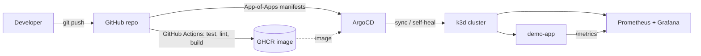

# GitOps Platform

A small but **production-shaped** platform that runs entirely on a local
Kubernetes cluster and is driven end-to-end by Git. Push code → CI builds and
publishes a container image → **ArgoCD** reconciles the cluster to match Git →
**Prometheus & Grafana** observe the result.

Built to be reproducible by anyone in one command, at zero cost.



## Stack

| Concern        | Tool                                   |
| -------------- | -------------------------------------- |
| Local cluster  | [k3d](https://k3d.io) (k3s in Docker)  |
| GitOps         | [ArgoCD](https://argo-cd.readthedocs.io) — App-of-Apps |
| Packaging      | [Helm](https://helm.sh)                |
| CI / Registry  | GitHub Actions + GHCR                  |
| Ingress        | ingress-nginx                          |
| Observability  | kube-prometheus-stack (Prometheus, Grafana, Alertmanager) |
| App            | Go (stdlib only), exposes `/metrics`   |

## Repository layout

```
.
├── app/                 # Go web service + Dockerfile (distroless, non-root)
├── charts/demo-app/     # Helm chart (probes, ServiceMonitor, PDB, ingress)
├── clusters/
│   ├── bootstrap/       # App-of-Apps root Application
│   └── apps/            # one Application per platform component
├── .github/workflows/   # CI: test → lint → build & push image
├── k3d-config.yaml      # cluster definition (traefik off, port 8080→80)
├── platform.sh          # orchestration (up / demo / bootstrap / down …)
└── Makefile             # `make up` wrapper around platform.sh
```

## Prerequisites

- Docker (running)
- `kubectl`, `helm`, `k3d`
- On Windows: run the commands from **Git Bash** (`./platform.sh …`).
  On macOS/Linux you can use `make` instead.

## Quickstart

### Option A — Local demo (no GitHub needed)

Get the app and dashboards running immediately, deployed straight via Helm:

```bash
./platform.sh up      # cluster + ingress + ArgoCD + build & import the image
./platform.sh demo    # deploy demo-app + Prometheus/Grafana locally
```

Then open:

- App → http://demo.localhost:8080
- Grafana → http://grafana.localhost:8080 (`admin` / `admin`)

> `*.localhost` resolves to 127.0.0.1 in Chromium-based browsers. For curl:
> `curl -H 'Host: demo.localhost' http://localhost:8080/metrics`

### Option B — Full GitOps (the real thing)

1. Push this repo to GitHub.
2. Point the manifests at your repo and commit:
   ```bash
   ./platform.sh configure <your-github-username>
   git commit -am "configure repo owner" && git push
   ```
3. Register the platform with ArgoCD:
   ```bash
   ./platform.sh up         # if not already done
   ./platform.sh bootstrap  # applies the App-of-Apps root
   ```

ArgoCD now continuously syncs the cluster from Git. Change `replicaCount` in
`charts/demo-app/values.yaml`, push, and watch ArgoCD roll it out — with
`selfHeal` reverting any manual drift.

Open the ArgoCD UI:

```bash
kubectl -n argocd port-forward svc/argocd-server 8081:443
# https://localhost:8081 — user: admin
./platform.sh argocd-password   # prints the initial password
```

## What this demonstrates

- **GitOps** with ArgoCD App-of-Apps, automated sync, prune and self-heal.
- **Helm** chart authoring: templating, probes, resource limits,
  `ServiceMonitor`, `PodDisruptionBudget`, hardened `securityContext`.
- **CI/CD**: tested, vetted, chart-linted, multi-tag image pushed to GHCR with
  build cache.
- **Observability**: app metrics scraped by Prometheus and graphed in Grafana.
- **Reproducibility**: the whole platform stands up (and tears down) with one
  script, on a free local cluster.

## Teardown

```bash
./platform.sh down
```

## Roadmap ideas

- Sealed Secrets / External Secrets for secret management
- A Grafana dashboard provisioned as code + a Prometheus alert rule
- Progressive delivery (Argo Rollouts canary)
- `kustomize` overlays for a `staging` vs `prod` namespace split
```
